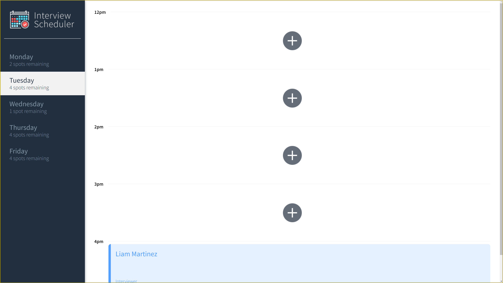
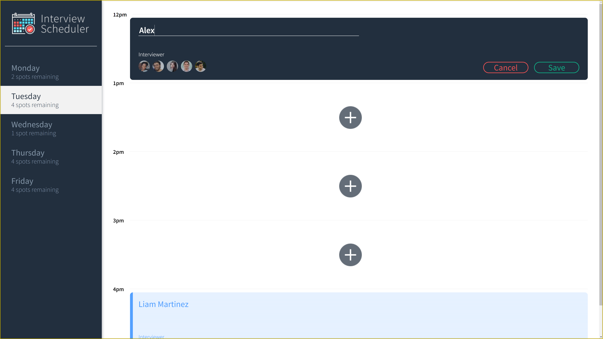
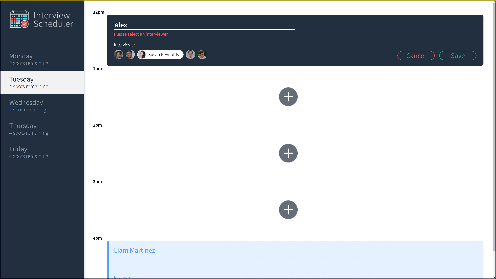
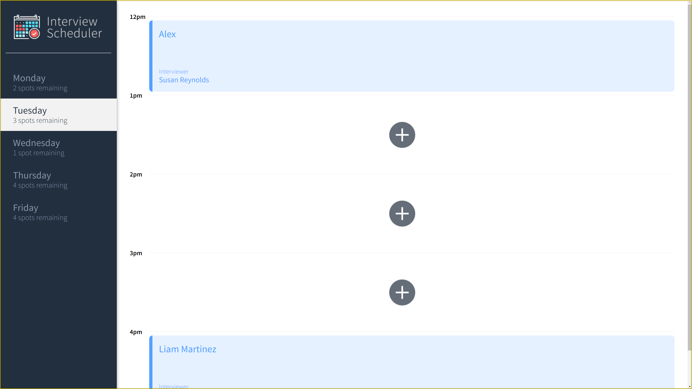

# Interview Scheduler

## Description
The Interview Scheduler is a React-based web application primarily focused on front-end development. It employs Test-Driven Development (TDD) methodologies with Jest and Cypress as the core testing frameworks.

### Core Focus
- **React Development**: Utilizes React for building an interactive and dynamic user interface.
- **Test-Driven Development (TDD)**: Implements Jest and Cypress for unit testing and end-to-end testing.

## Media

### **`VIDEO`**

https://github.com/AlexTamayo/scheduler/assets/3316856/76ea28b6-73e7-44a8-a7a9-cb27b33968b8

### **`IMAGES`**










## Features
- Create, edit, and delete interview appointments.
- Interactive user interface with real-time updates.
- Comprehensive test coverage using Jest and Cypress.

## Technologies Used
- React for front-end development
- Jest and Cypress for testing

## Setup

Install dependencies with `npm install`.

### Running Webpack Development Server

```sh
npm start
```

### Running Jest Test Framework

```sh
npm test
```

### Usage

1. Start the application by running npm start.
2. Navigate to http://localhost:3000 in your web browser.
